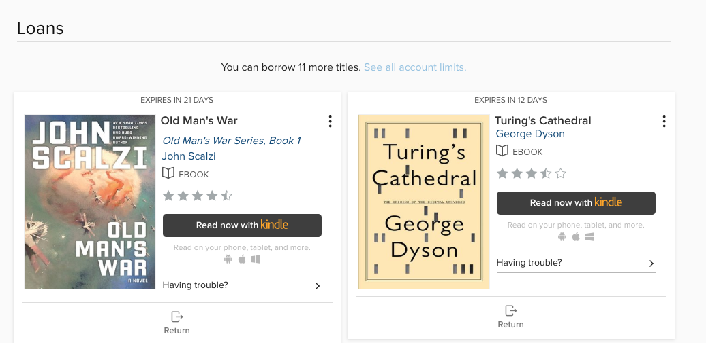
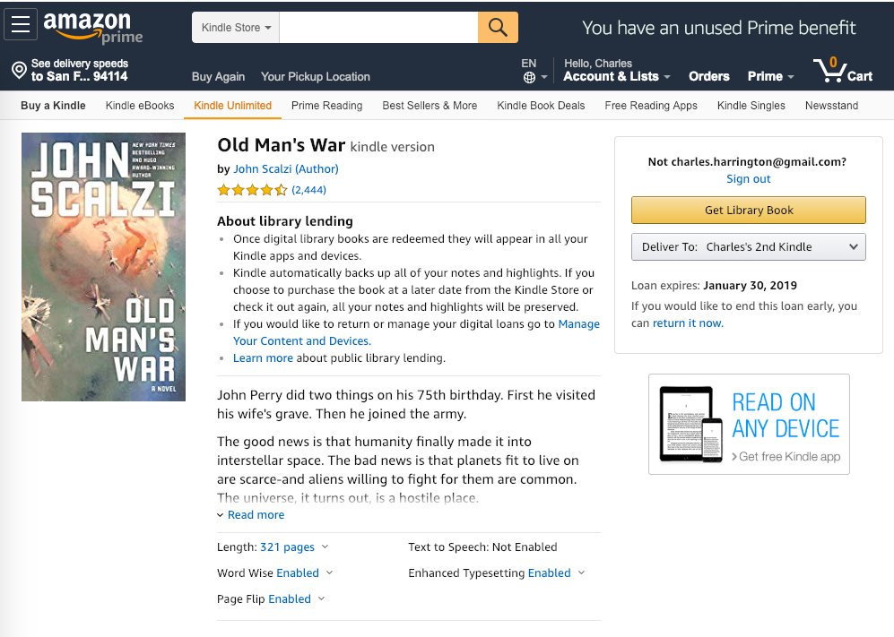
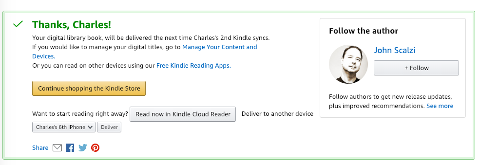

Basically, do it. It's super easy. **I'll show you how in this post.**

### How to borrow library books for your Kindle

1. **Obtain a Kindle from Amazon.** I'm using the Kindle Paperwhite with Special Offers, which I recommend. The special offers are just ads for random books, and they only appear on the lock screen of the Kindle. Who knows? You might even find something you like with the offers.
2. **Obtain a library card number from your local library.** This takes a few minutes in person, but I'm sure you can also do it online. You'll probably need some proof of residence, like a driver's license or some utility bill. Better be safe and bring both.
3. **Sign into your library's ebook manager on the library's website using your library card number**. Most likely they are using a service called Overdrive. You'll probably also create a PIN number when you register for your library card, so write that down somewhere!
4. **Search for a book on Overdrive (or your library's respective ebook service), and then you'll be able to either borrow or place a hold for it.** The San Francisco Public library, for example, allows you to borrow or place holds for up to something like 20 books at a time!
5. **Once you've borrowed a book, click Read Now with Kindle**. You'll been taken to the Amazon page for the book, and you can send the ebook directly to your Kindle. Next time your Kindle connects to wifi, the borrowed book will be downloaded.
6. **Read, rinse, and repeat.** I like to have several books borrowed at a time, with a few holds as well, so that there's always something coming down the pipe.

#### 🎁 Placing holds for books is like sending a gift to your future self

Imagine waking up to this email:

It's like Christmas morning! Once you click that link, you'll be taken to your Overdrive account:

Even before you've had your (first) coffee of the day, you can probably manage to click that `Read Now with Kindle` button:

Click `Get Library Book`, and you're done! Your morning commute just got a little bit nerdier.

### Borrowing Audiobooks

You can do this, too! 

There's a great app called [Libby](https://meet.libbyapp.com/) that is somehow affiliated with Overdrive, and that's what I recommend using for listening to library audiobooks. Everything that you rent through Overdrive, whether ebook or audiobook, will automatically appear in your Libby app (once you sign into Libby with your library card). This is helpful for when you inevitably forget your Kindle at home (there's also a Kindle phone app, but I haven't used it recently).

I still haven't entirely embraced the audiobook lifestyle, but it's something on my mind for 2019.

### But what about how good paper books smell?

I'm a paper book monster. And, yes, the smell is half the reason. But public libraries are vitally important -- and were vitally important to my childhood. I'm happy to be bringing them back into my adult life, even in this electronic way.

I'm also still buying an insane amount of paper books, from local booksellers whenever possible. Not even Marie Kondo can stop me from that.