That Monday morning in February began like any other Monday: I opened my phone immediately upon waking up, browsed Twitter, checked Instagram, and ignored my email, all from bed, making no pretense of daily gratitude journaling. I got up to make the coffee, and then opened eBay to look at old computers.

eBay thrills in me in an early Internet kind-of-way. It's dirty. You can't believe it works. And you can still find a deal.

My greatest feat of all was the 2006 purchase of a Fender American Stratocaster for roughly $300 bucks which had been mislisted into an "Fender - Other" category. Its description warned that the guitar was "missing a few strings."

Jackpot.

I'd been waffling between a [Commodore VIC-20](https://en.wikipedia.org/wiki/Commodore_VIC-20) and some kind of Apple II in my vintage computer fantasies. As an undying fan of YouTube's [The 8-Bit Guy](https://www.youtube.com/channel/UC8uT9cgJorJPWu7ITLGo9Ww)<sup>1</sup>, I longed for a computer of my own that I could clean with hydrogen peroxide and baking soda, as I wondered what sad fate the brave, worthy computer had faced before meeting me, its benevolent new master. We'd write infinite loops in BASIC together. We'd travel the Oregon Trail. We'd poke each other's memory.

I set a few auctions to my watch-list, and then laced on my sneakers for our morning run. Not one block away from our house did I spot something: a yellowed plastic box amid a pile of trash. No. It couldn't be. I stopped, and went back to the trash.

It was an Apple IIe. With its CRT monitor. And a dual floppy drive.

Just. SITTING. THERE.

I explained the situation to Carly. She suggested, wisely, that we continue our run, of which we were less than 30 seconds into, and that if the computer was still outside when we got back, that I should knock on the door of the house, to confirm it was truly being thrown out.

The next 30 minutes were agony. I've never ran so fast in my life.

But it was still there.

I knocked on the door. They were remodeling, I could hear saws or something inside. No one answered. I knocked again. I considered, you know, for a second, just taking it. Finally, the door opened. I introduced myself, likely sounding as insane as felt, and asked if the computer in the trash was.. trash. She nodded, and mentioned that, "It still works."

> It still works.

No better sounds could have been uttered.

### Plugging it in

I carried my Precious back home and hurried to plug it in.

Except the monitor cable was missing. I was certain that I'd grabbed everything of computer-ish value from the trash pile. From the looks of the port, I'd need one of those old mono RCA cables, of which I know I have dozens in my parent's attic across the country in New Jersey. 

I still turned on the computer and the monitor anyway, and was relieved to hear it chirp happily, even if I couldn't see anything.

By this point, it was high time to get on my bike and head into work (back when we still things like that). But I still made a quick pit-stop at a hardware store along the way, and somehow a physical store in the physical world still carried this little guy:


That night, after work, I turned it on. One beep and then:

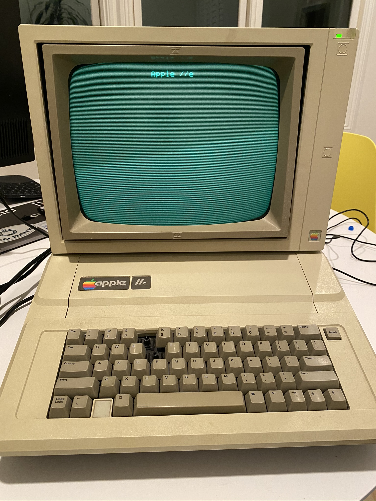

"Isn't it beautiful?" I said to Carly. "And don't you just love how the `II` is shown as `//` slashes. The green, too, it's like something out of the Rebel Alliance."

"Yes, and what do you do with it?"

"Well... you just..."

Truth was I didn't know how to advance past this welcome screen. My benefactors neglected to include the computer manual for the Apple IIe in their trash. This is a major bummer on multiple fronts, because what I've learned about computer manuals from the 1980s is that they were AWESOME. I recently picked up both the Commodore VIC-20 manual and the Commodore 64 manuals on eBay, even though I have neither machine, because I wanted to enjoy their spiral-bound goodness.

But I'm a software engineer. I know how to Google. Soon, a `Ctrl-Reset` had me at the BASIC prompt.

I was ready for this.

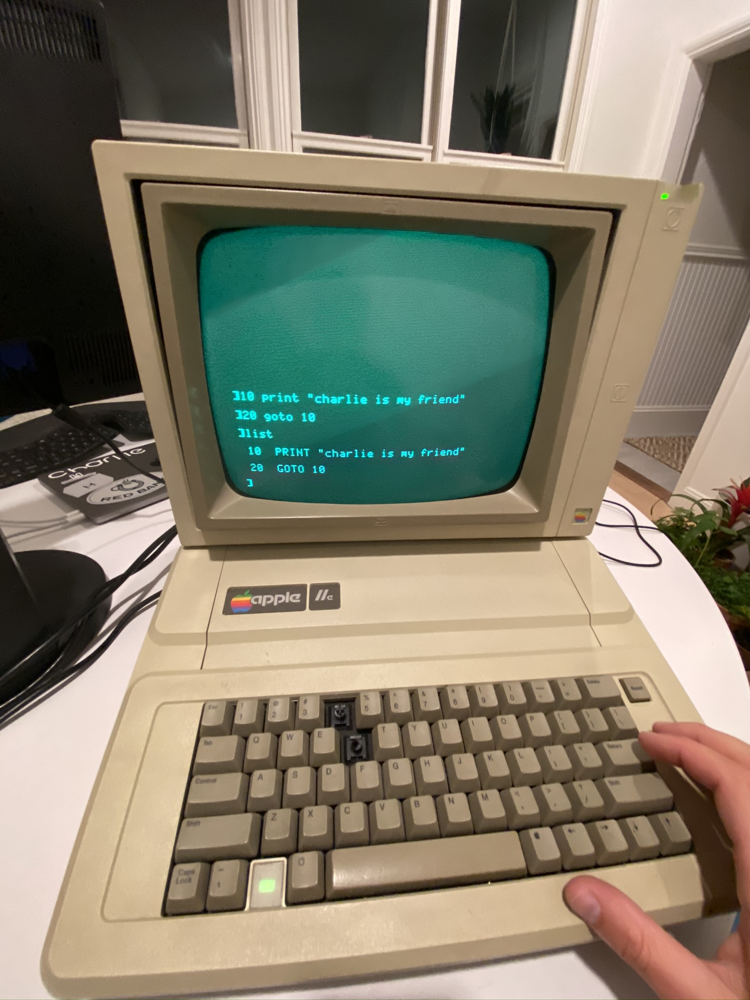


I didn't grow up coding in BASIC, but I'm a student of history. I certainly knew that it's a rite of passage to code up a little infinite loop whenever you see a BASIC prompt.

Carly nodded. "Cool. Why does it smell like a campfire?"

### Capacitor problems

Uh-oh. That pop that I'd heard seconds before, and willfully ignored, might not have been a good pop. The smell grew worse.

> Burnt marshmallows on blacktop.

I flipped off the power. I forgot to mention I already had the fire extinguisher at the ready, but it didn't look like that'd be necessary. Unfortunately, the smell didn't disappear after turning off the power.

Some more Googling revealed the likely problem: a capacitor popped in the power supply. I unscrewed the power supply from the computer (held on by just four small screws), and put it somewhere far away. Days later, weeks later, the power supply still smelled.

At this point, if had been a more experienced solder-er, I would have considered buying a capacitor for like ten cents and replacing it myself. But as I'm still learning the ropes of soldering, and hacking with power supplies felt a little ahead of me, I thought about getting some more experienced help. (Also, I was kinda terrified that I would accidentally short circuit something and fry the motherboard, before I ever got to really play with the computer).

I spent some time looking for an Apple repair store that would service Apple II's. Even in the Bay Area, this felt like a lost cause. Then someone suggested this site: [ReActiveMicro](https://www.reactivemicro.com/). Its tagline: `Reactivate Your Vintage Apple Computer`. For $95, I could order a [new power supply](https://www.reactivemicro.com/product/ultimate-universal-power-supply/) for my Apple IIe.

So I did. It arrived in the mail about a week later, and I installed it in roughly a minute and half. With the extinguisher again at the ready, I turned on the computer again.

And it worked! I looked up an old program in an old Apple magazine online, and coded up this little sine wave program:

<blockquote class="twitter-tweet"><p lang="en" dir="ltr">Back in business <a href="https://twitter.com/hashtag/appleiie?src=hash&amp;ref_src=twsrc%5Etfw">#appleiie</a> <a href="https://t.co/AHi9EBdbVm">pic.twitter.com/AHi9EBdbVm</a></p>&mdash; Charlie Harrington (@whatrocks) <a href="https://twitter.com/whatrocks/status/1231624493040193537?ref_src=twsrc%5Etfw">February 23, 2020</a></blockquote> <script async src="https://platform.twitter.com/widgets.js" charset="utf-8"></script>

### Expansion slots

Now that I've got a working, adorable Apple IIe, the first thing I decide to do is take it apart. Say what you will about the [new Mac Pro case design](https://www.apple.com/mac-pro/), but it's got nothing on this little hatch.


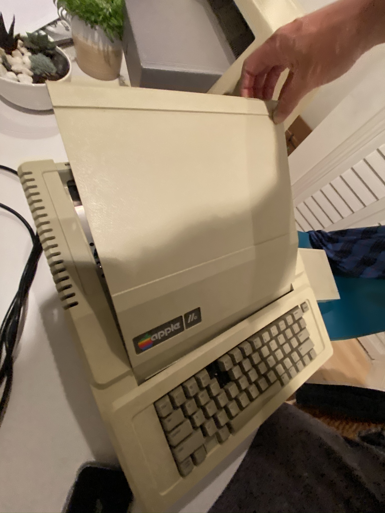

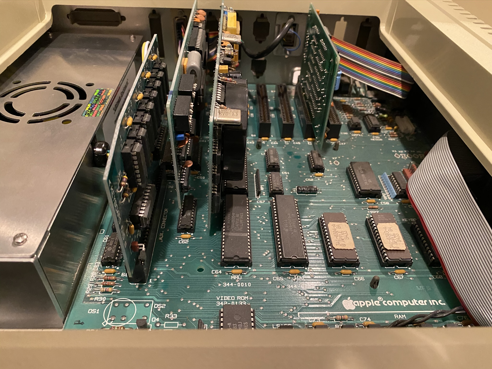

As you can see, I've hit a pretty big jackpot on the expansion card front. I'll walk through each card individually in a bit.

Here's a bare-bones look at the motherboard after removing all the expansion cards.


And a close-up of the seven (7!) expansion slots, not including the extra one for adding more memory or 80-column mode.


This again reminds of the recent discussions on [Accidental Tech Podcast](https://atp.fm) and other podcasts about the new Mac Pro and its expansion slots. There was a lot of fun discussion about what John Siracusa was going to put into his long-awaited Mac Pro's expansion slots.

But, in modern computers, I haven't seen much that's really that interesting as far as expansion slots go. Mostly, I've heard about video cards and more storage. Otherwise, your computer mostly has everything it needs for the majority of use-cases.

Which is completely the opposite for the Apple II. 

These expansion slots in Apple II computers CHANGED your computer. Transmogrified it into something altogether new and exciting. Want to print something? Get a card for it. Go on the.. ARPANet? Get a modem card. Need to save a program on something other than tape cassette recorder (which itself is crazy and I want to try)? Better get a floppy driver card!

Even the back of the Apple IIe shows the potential of this machine to be utterly transformed by each owner. These slots are yours for the shaping, dear computer user.


So, anyway, what the heck did I find inside my Apple IIe? Let's go through them one-by-one.

#### Extended 80-Column Text Card 

The [Extended 80-Column Text Card](https://en.wikipedia.org/wiki/Apple_80-Column_Text_Card) is quite literal: it gives you 80 columns of text instead of 40! Mine also provides extra RAM, bringing my Apple IIe's total RAM up to a whopping 128kB.

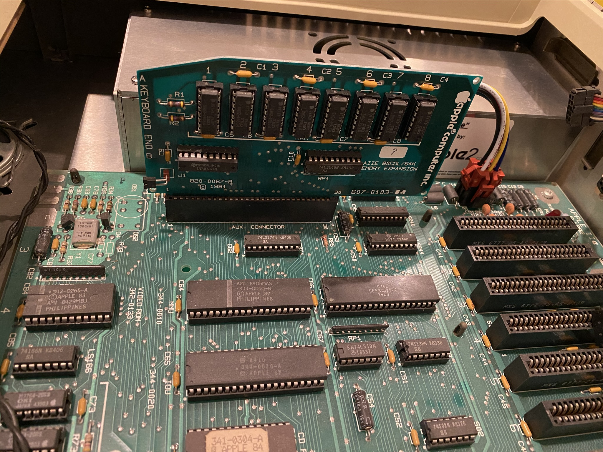


How do you get into 80-column mode? Type `PR#3` into the BASIC prompt. It kinda looks worse on this monitor, but I can already see the value for more complex programs.

#### Super Serial Card II

I am probably most excited about this card. The [Super Serial Card II](https://en.wikipedia.org/wiki/Apple_II_serial_cards) can be used as a modem, a printer connection, and I have a pretty good suspicion that I'll be able to connect to it an Arduino or a Raspberry Pi for some fun.


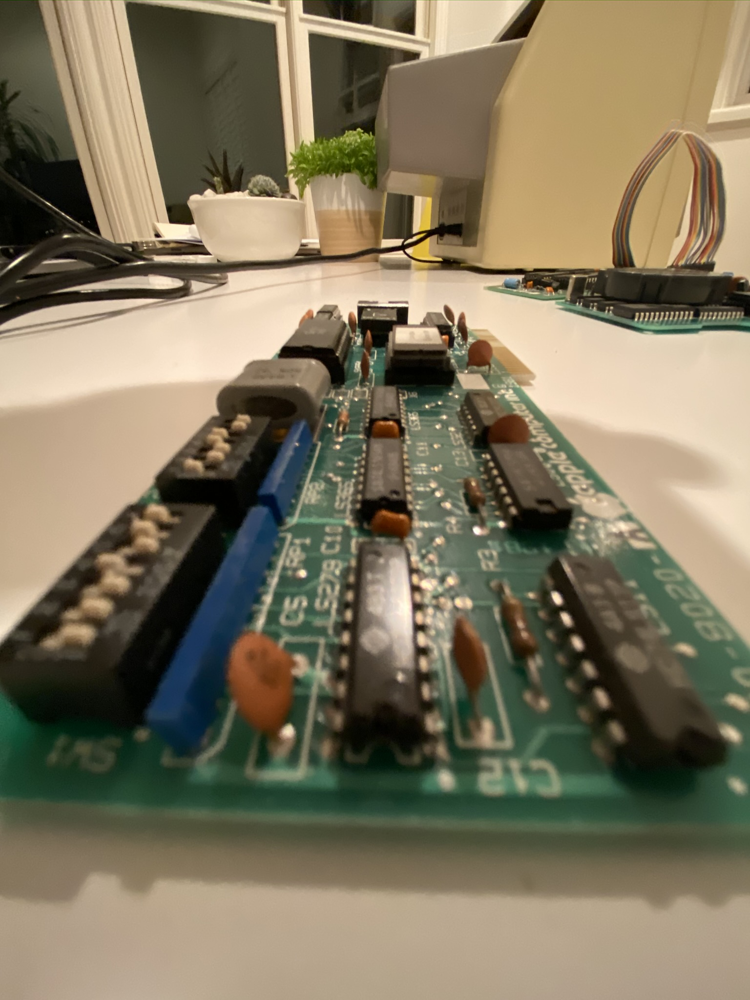

#### MicroModem IIe

It's a modem! With an external port that looks like a telephone jack. Some wizards at work told me that I probably cannot just plug this into a modern phone line and expect it to work, though. They said that phone lines don't really work the same way anymore. This is something I'm not quite clear on yet, but I did manage to find the [Micromodel II Owner's Manual](https://apple2online.com/web_documents/hayes_micromodem_ii_owner__s_guide.pdf), so there could be some fun to be had here.

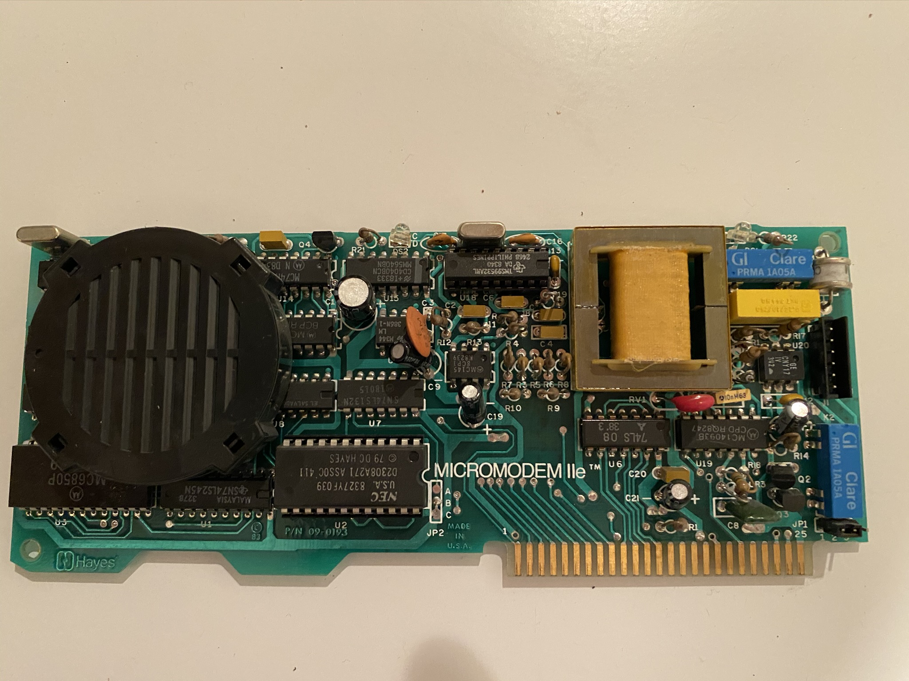

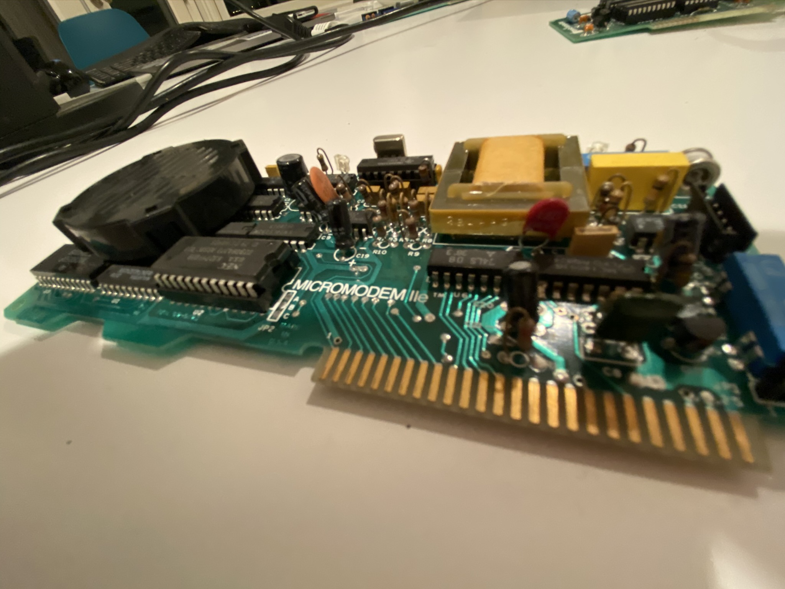

#### DuoDisk and Disk II Card

The [DuoDisk](https://en.wikipedia.org/wiki/Disk_II#DuoDisk) is a combination drive with two 5 1/4-inch floppy drive bays next to each other. It looks nice when you sandwich it between your Apple II and its monitor.

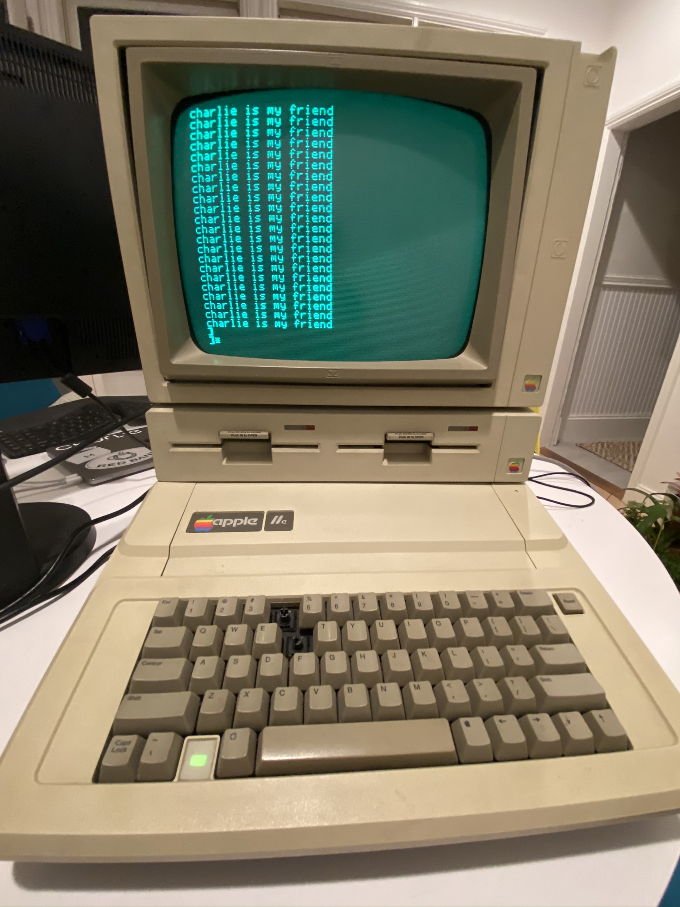

The card uses the same Disk II system famously designed by Woz. The [Wikipedia](https://en.wikipedia.org/wiki/Disk_II) entry on the Disk II is fascinating and well-worth the quick read. Apparently, the Apple II was getting a lot of flak for not including a disk drive, instead relying on external cassette tape storage. Woz's solution was the Disk II system, a simpler design than the industry standards, proved incredibly successful, both financially and functionally. Per Wikipedia:

> Wozniak called the resultant Disk II system "my most incredible experience at Apple and the finest job I did", and credited it and VisiCalc with the Apple II's success.

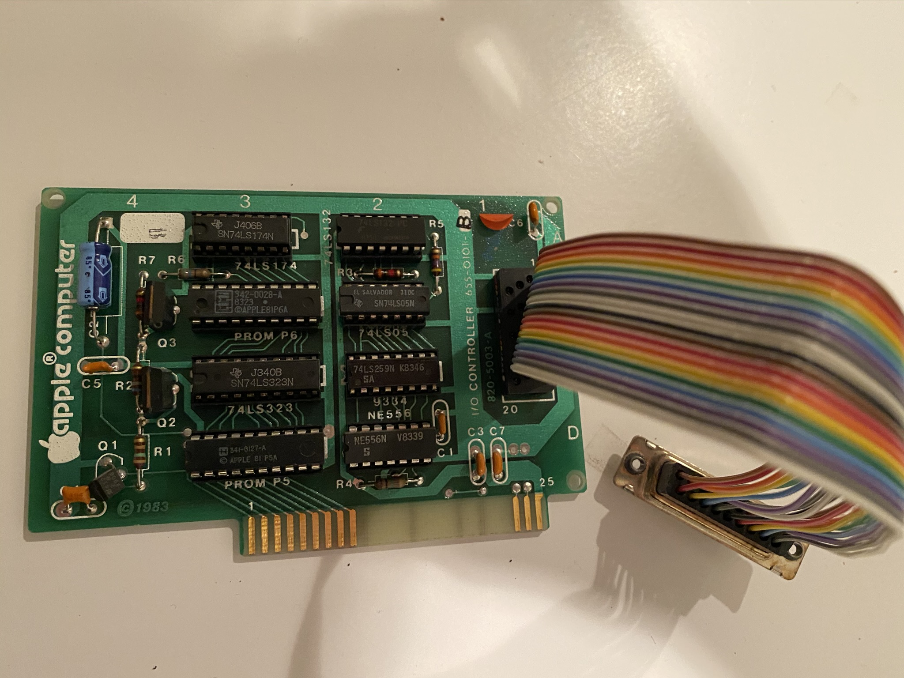

If anyone's got any spare 5 1⁄4-inch floppies, let me know, because now I've got two whole slots for them (this is actually a serious inquiry, please [tweet](https://twitter.com/whatrocks) at me!).

### So, what are you doing to do with your new old computer, Charlie?

I'm not sure. Here are some of my thoughts.

#### Serial port

As mentioned, I suspect that I'll be able to figure out how to use the Super Serial II card with an Arduino or Raspberry Pi.

I recently found a project that uses Raspberry Pi in such a way that it accepts keyboard input from the Apple II and displays its output on the Apple monitor. Definitely want to try that.

But I'm also eager to see if I can rig it up such that I can effectively SSH/remote into the Apple IIe from a laptop, using a Raspberry Pi as a bridge of some kind via the Super Serial II card. 

This project is definitely my top priority, because it seems odd and useful. I'd really like to be able to write programs for the Apple IIe and easily save them to GitHub. Being able to write them on my laptop and simply transfer them to the Apple for processing seems like a hilariously fun and distracting project to work on next.

#### Repairs

These are smaller efforts, which means they'll likely linger for a while.

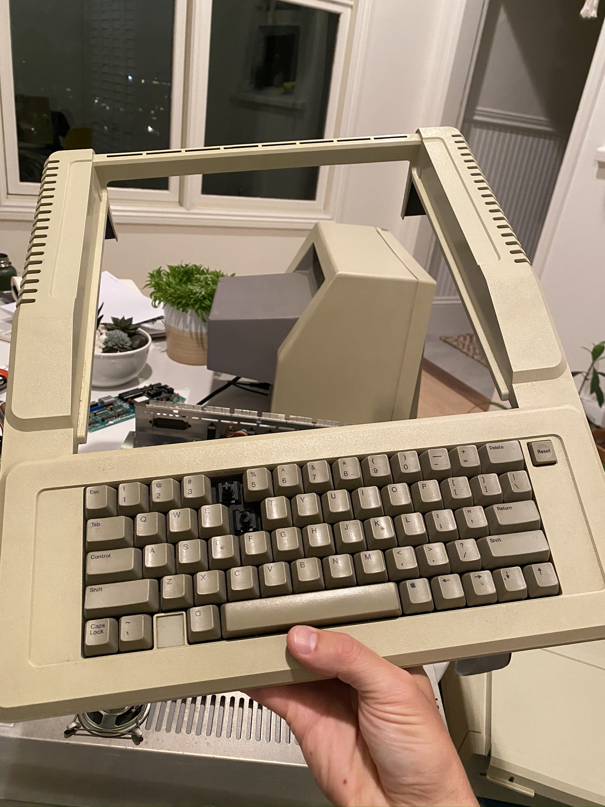

- Find replacement keys for my missing keys. I hope this doesn't mean buying an entire *other* Apple IIe. Or do I?
- "Retro-brite" and deep clean - a la 8 Bit Guy - to make the case look brand new

#### Games

I currently have zero software for the Apple IIe. None. Zilch. Which means I have no games. I know that, back in the 1980s, magazines used to print out source code for games, and kids would spend hours plugging them into their Apple IIs or Commodores, praying that they hadn't made a syntax error. Once their games were up and running, this proved a great chance for the curious ones to start messing around with the source code, tweaking it, and eventually making their own games. I'm sure that many of these games and magazines are now scanned and available online. I'll definitely be checking those out.

I'd also be very open to buying some classic Apple II games on eBay. I'd love to hear of favorites or any suggestions.

#### Storage

Given that I immediately lose everything anytime the power goes out (or I simply turn off the computer), these two projects seem important:

- Get a tape recorder and figure out how to save a program to tape, and then rewind / reload it
- Find some blank floppies and do the same

#### Programming

Other than AppleSoft BASIC (which was written by Microsoft! For Apple!!), which is burned into a ROM chip on the Apple II, there's also some sort of built-in assembler that you can access by typing this into the BASIC prompt:

```
CALL-151
```

I believe this is where I'll be able to do some of the more Commodore 64-like peeking and poking directly at memory. I have a feeling there's a lot of exploring (and fun) to be done here. I need to read up more on this.

### One more thing

This computer represents to me the lost era of computer as appliance. I'm talking about "bicycle for the mind" type-of-stuff. When you still sat down and said, "I'm going to computer now." Or, as in my childhood, "May I please go on the computer now, Mom, PLEASE?"

We're much closer to cyborgs now, with our phones and watches and speakers and other do-dads. Computers are part of us. They're attached to us, they're in our pockets, they're in our bags, they're next to us when we go to sleep. You can't escape them, and as a result, you're no longer able to make an active choice about whether or not to use them. The best we've got is Screen Time warnings, a penal code to make us use them less.

That's why this Apple IIe is such an important machine to me. It's something I can actively choose to dive into and explore. It's the same thing I feel when I really get into a novel. I'm in another world.

And here a few more close-ups of the computer as a reward for making it this far.

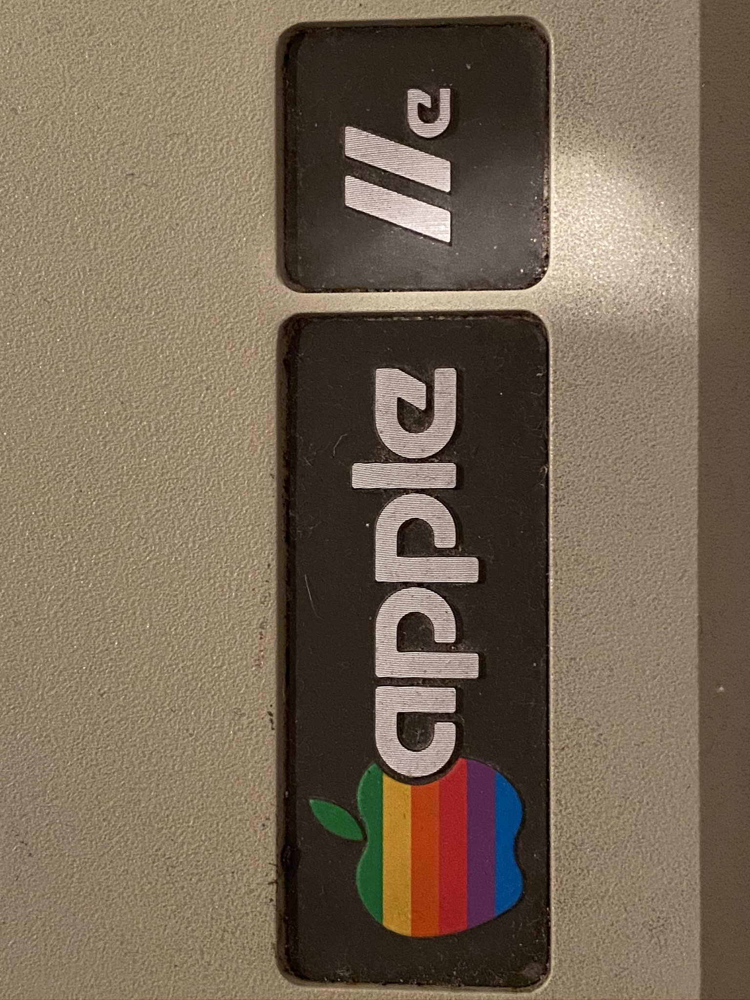

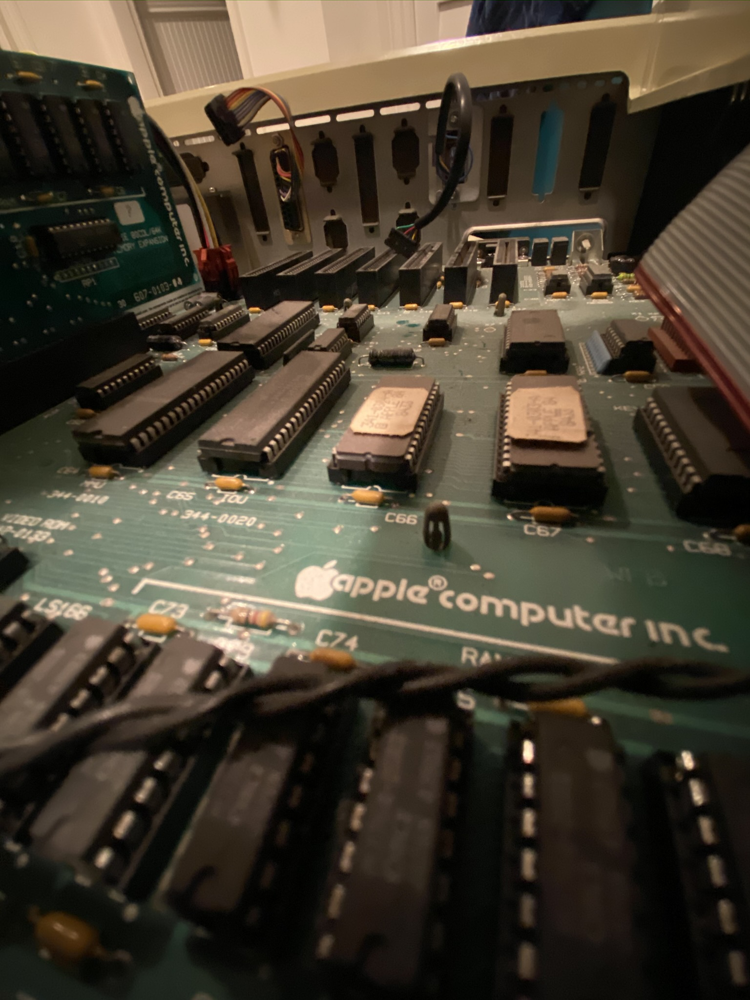

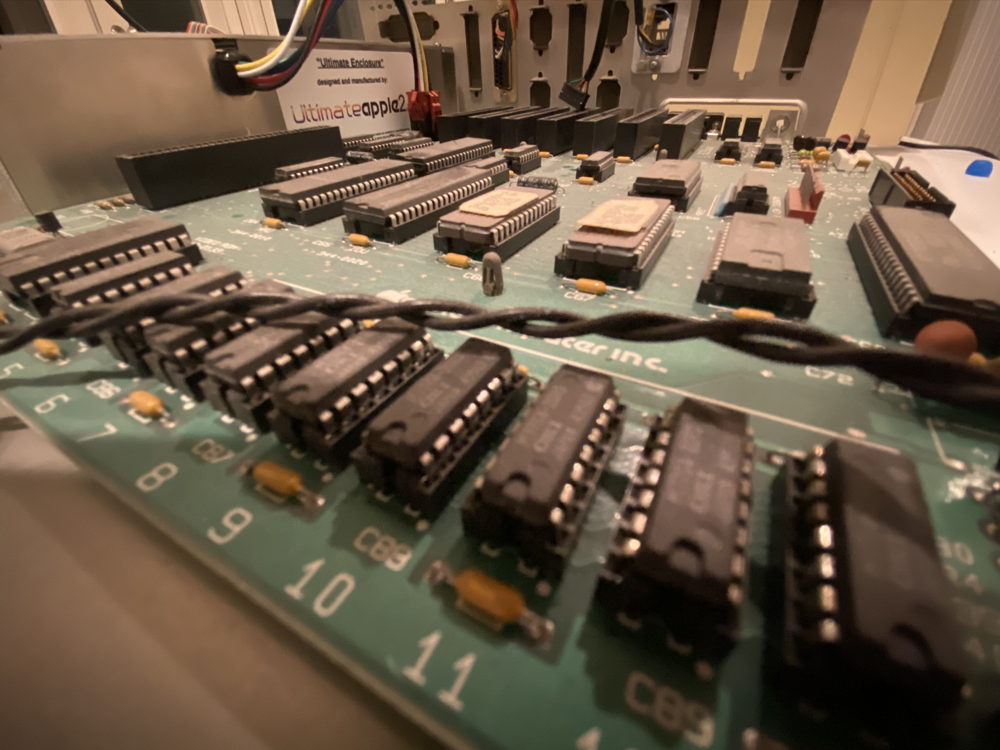


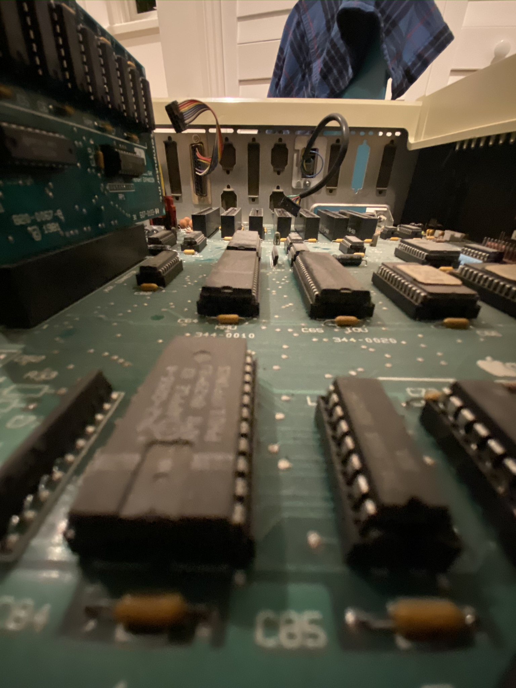

#### Footnotes

1. For the uninitiated, I suggest starting with Part 1 of The 8-Bit Guy's masterful two series: [Restoration - The Worst VIC-20 I've ever seen - Part 1](https://www.youtube.com/watch?v=A_vpfBJZ7JI). I don't know why I like watching this man clean and restore old computers so much, but there it is - I just do.
